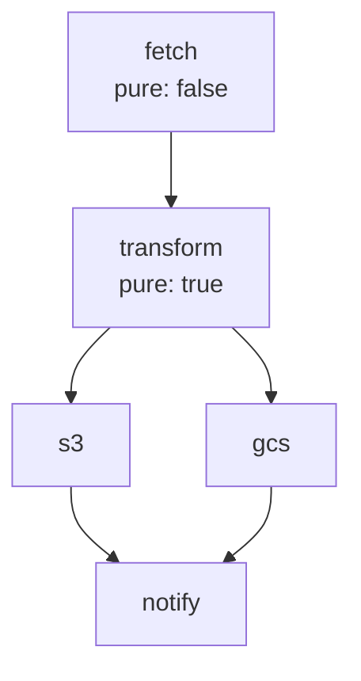

# Effect System & DAG Library Plan

## Executive Summary

Design and implement a comprehensive Effect system for Elixir inspired by Effect-TS, with a reusable DAG library. The Effect type will provide lazy, composable, typed effects with dependency tracking, eventually deprecating Pipeline.

---

## Core Design Principles

1. **Lazy by Default**: Effects are descriptions until `Effect.run*` - nothing executes until then
2. **Pure Until Run**: All Effect combinators are pure; only `run_sync/run_async` performs side effects
3. **Parallel by Default**: `Effect.all` runs in parallel unless `mode: :sequential` is specified
4. **DAG-Based Composition**: Steps form a directed acyclic graph with automatic parallelization
5. **Protocol Integration**: Leverage Recoverable, Normalizable, Identifiable for smart error handling
6. **First-Class Introspection**: ASCII diagrams, Mermaid charts, (opt-in) execution state queries
7. **Req/Plug Pattern**: Build up description, execute at end (like middleware stack)
8. **Saga-First**: Built-in compensation/rollback for distributed transactions

---

## Part 1: DAG Library (`libs/dag/`)

### Purpose
Standalone, reusable DAG library for Effect, Workflow, and future systems.

### Structure
```
libs/dag/
├── lib/
│   ├── dag.ex                    # Main entry (delegating facade)
│   ├── dag/
│   │   ├── graph.ex              # Core immutable DAG struct
│   │   ├── node.ex               # Node struct with metadata
│   │   ├── builder.ex            # Fluent builder API
│   │   ├── algorithms/
│   │   │   ├── topological.ex    # Kahn's algorithm, DFS sort
│   │   │   ├── cycle_detection.ex
│   │   │   ├── critical_path.ex
│   │   │   └── reachability.ex
│   │   ├── visualization/
│   │   │   ├── ascii.ex          # ASCII art diagrams
│   │   │   ├── mermaid.ex        # Mermaid.js format
│   │   │   └── dot.ex            # Graphviz DOT format
│   │   └── introspection.ex      # Query functions
│   └── mix.exs
```

### Key Data Structures
```elixir
# DAG.Graph - Immutable graph with O(1) lookups
%DAG.Graph{
  nodes: %{node_id => DAG.Node.t()},
  edges: %{node_id => MapSet.t(node_id)},       # outgoing
  reverse_edges: %{node_id => MapSet.t(node_id)}, # incoming
  __cached__: %{topological_order: nil, levels: nil}
}

# DAG.Node - Node with execution metadata
%DAG.Node{
  id: atom(),
  label: String.t(),
  metadata: %{pure: boolean(), timeout: integer() | nil},
  weight: pos_integer(),  # for critical path
  group: atom() | nil     # for parallel grouping
}
```

### Core API
```elixir
# Builder
DAG.new(:workflow)
|> DAG.node(:fetch, label: "Fetch Data")
|> DAG.node(:transform, after: :fetch)
|> DAG.node(:upload, after: :transform, group: :parallel)
|> DAG.build!()

# Algorithms
DAG.topological_sort(dag)           #=> {:ok, [:fetch, :transform, :upload]}
DAG.levels(dag)                      #=> {:ok, [[:fetch], [:transform], [:upload]]}
DAG.critical_path(dag)              #=> [:fetch, :transform, :upload]
DAG.reachable(dag, :fetch)          #=> [:transform, :upload]

# Visualization
DAG.to_ascii(dag)                   #=> ASCII diagram string
DAG.to_mermaid(dag)                 #=> Mermaid.js diagram
DAG.to_dot(dag)                     #=> Graphviz DOT format
```

---

## Part 2: Effect Type (`libs/fn_types/lib/fn_types/effect/`)

### Structure
```
libs/fn_types/lib/fn_types/
├── effect.ex                     # Main Effect type
├── effect/
│   ├── constructors.ex           # succeed, fail, sync, async, service
│   ├── combinators.ex            # map, flat_map, zip, all
│   ├── error_handling.ex         # catch_all, catch_some, either, option
│   ├── concurrency.ex            # parallel, race, hedge, timeout
│   ├── retry.ex                  # retry with Schedule
│   ├── schedule.ex               # Composable retry schedules
│   ├── resource.ex               # bracket, ensuring, scoped
│   ├── context.ex                # Service/dependency injection
│   ├── introspection.ex          # to_dag, steps, summary, visualize
│   ├── runtime.ex                # run_sync, run_async, run_with
│   ├── step.ex                   # Step wrapper for workflows
│   └── decorators.ex             # @decorate effect() support
```

### Effect Type (Lazy AST)
```elixir
defmodule FnTypes.Effect do
  @type op ::
    {:succeed, term()}
    | {:fail, term()}
    | {:sync, (-> term())}                    # Impure
    | {:async, (-> term())}                   # Impure async
    | {:suspend, (-> t())}                    # Lazy thunk
    | {:map, t(), (term() -> term())}
    | {:flat_map, t(), (term() -> t())}
    | {:catch_all, t(), (term() -> t())}
    | {:parallel, [t()], keyword()}
    | {:race, [t()], keyword()}
    | {:retry, t(), Schedule.t()}
    | {:timeout, t(), pos_integer()}
    | {:bracket, acquire: t(), use: (term() -> t()), release: (term() -> t())}
    | {:access, atom()}                       # Service lookup
    | {:provide, t(), map()}                  # Provide services
    | {:annotate, t(), atom(), term()}        # Metadata for introspection

  @type t :: %__MODULE__{
    op: op(),
    __meta__: %{
      label: atom() | nil,
      pure: boolean(),
      timeout: pos_integer() | nil,
      retries: non_neg_integer(),
      dependencies: MapSet.t(atom()),
      annotations: map()
    }
  }
end
```

### Core API
```elixir
# Constructors (all lazy - nothing executes)
Effect.succeed(42)                            # Pure success
Effect.fail(:not_found)                       # Pure failure
Effect.sync(fn -> DateTime.utc_now() end)     # Impure (marked as such)
Effect.attempt(fn -> Repo.get(User, id) end)  # From {:ok, _} | {:error, _}
Effect.service(:database)                     # Service dependency
Effect.from_mfa({Mod, :fun, [args]})          # From MFA tuple

# Labeling (for introspection)
Effect.label(effect, :fetch_user)

# Combinators
Effect.map(effect, &transform/1)
Effect.flat_map(effect, fn x -> Effect.succeed(x * 2) end)
Effect.and_then(effect, &next_effect/1)       # Alias for flat_map
Effect.zip(effect1, effect2)                  # Tuple result
Effect.all([e1, e2, e3])                      # Parallel by default!
Effect.all([e1, e2, e3], mode: :sequential)   # Opt-in sequential

# Error Handling
Effect.catch_all(effect, fn error -> Effect.succeed(:fallback) end)
Effect.catch_some(effect, fn :not_found -> Effect.succeed(nil); _ -> nil end)
Effect.either(effect)                         # {:ok, a} | {:error, e} in success channel
Effect.option(effect)                         # nil on error
Effect.map_error(effect, &transform_error/1)

# Concurrency
Effect.parallel(effects, max_concurrency: 10)
Effect.race(effects)                          # First success wins
Effect.hedge(primary, backup, delay: 50)      # Hedged request
Effect.timeout(effect, 5000)

# Retry with Schedule
schedule = Schedule.exponential(100)
           |> Schedule.max_retries(5)
           |> Schedule.jitter(0.1)
           |> Schedule.recoverable_only()     # Uses Recoverable protocol
Effect.retry(effect, schedule)

# Resource Management
Effect.bracket(
  acquire: Effect.sync(&open_file/0),
  use: fn file -> Effect.sync(fn -> process(file) end) end,
  release: fn file -> Effect.sync(fn -> close(file) end) end
)

# Execution (ONLY place side effects happen)
Effect.run_sync(effect)                       #=> {:ok, value} | {:error, reason}
Effect.run_async(effect)                      #=> Task.t()
Effect.run_with(effect, %{database: Repo})    # Provide services
```

### Introspection API
```elixir
# Before running - analyze the effect
Effect.steps(effect)                          #=> [:fetch, :transform, :save]
Effect.dependencies(effect)                   #=> [:database, :cache]
Effect.pure?(effect)                          #=> false
Effect.summary(effect)                        #=> %{steps: 3, pure: false, ...}

# Visualization
Effect.to_dag(effect)                         #=> DAG.Graph.t()
Effect.to_ascii(effect)                       #=> ASCII diagram
Effect.to_mermaid(effect)                     #=> Mermaid diagram

# During execution (for long-running effects)
Effect.run_observable(effect, fn event ->
  # Receive :step_started, :step_completed, :step_failed events
end)
```

---

## Part 3: Schedule Type (Composable Retry)

```elixir
defmodule FnTypes.Effect.Schedule do
  @type t :: %__MODULE__{
    decide: (attempt :: integer(), error :: term() -> {:continue, delay_ms} | :stop),
    max_attempts: pos_integer() | nil,
    max_delay: pos_integer() | nil
  }

  # Constructors
  def fixed(delay)                    # Fixed delay
  def exponential(initial)            # delay * 2^attempt
  def linear(initial, increment)      # initial + (attempt * increment)
  def immediate()                     # No delay
  def never()                         # Never retry

  # Combinators
  def max_retries(schedule, n)        # Cap attempts
  def max_delay(schedule, ms)         # Cap delay
  def jitter(schedule, factor)        # Add randomness (0.0 - 1.0)
  def while(schedule, predicate)      # Retry while predicate true
  def recoverable_only(schedule)      # Only retry Recoverable errors
  def intersect(s1, s2)               # Both must continue
  def union(s1, s2)                   # Either can continue
end
```

---

## Part 4: Step System (Workflow Integration)

```elixir
defmodule FnTypes.Effect.Step do
  @type t :: %__MODULE__{
    name: atom(),
    effect: (map() -> Effect.t()) | {module(), atom(), [term()]} | Effect.t(),
    # Execution options
    timeout: pos_integer() | nil,
    retry: Schedule.t() | nil,
    # Saga/Rollback
    rollback: (map() -> Effect.t()) | nil,
    compensate: (map(), term() -> Effect.t()) | nil,  # Receives error
    # Conditional
    condition: (map() -> boolean()) | nil,
    # DAG positioning
    depends_on: [atom()],
    depends_on_any: [atom()],
    group: atom() | nil,
    # Metadata
    pure: boolean(),
    label: String.t(),                 # Human-readable label
    tags: [atom()]                     # For filtering/grouping
  }

  # Create step with all options
  Step.new(:fetch_user,
    fn ctx -> Effect.sync(fn -> Repo.get(User, ctx.user_id) end) end,
    label: "Fetch user from database",
    timeout: 5000,
    retry: Schedule.exponential(100) |> Schedule.max_retries(3),
    after: :validate_input,
    rollback: fn ctx -> Effect.sync(fn -> cleanup(ctx) end) end,
    pure: false,
    tags: [:database, :user]
  )

  # Convert to Effect
  Step.to_effect(step, context)       #=> Effect.t()
end
```

---

## Part 4.5: Saga Pattern (First-Class Rollback)

The Effect system provides first-class saga pattern support for distributed transactions:

```elixir
defmodule FnTypes.Effect.Saga do
  @moduledoc """
  Saga pattern for coordinating distributed transactions with compensation.

  Each step can define a rollback/compensation function that runs if:
  1. A subsequent step fails
  2. The saga is explicitly aborted
  3. A timeout occurs
  """

  # Build a saga from steps
  def new(name, opts \\ [])
  def step(saga, name, effect_fn, opts)  # opts include :rollback, :compensate
  def build(saga)                        #=> Effect.t()

  # Saga execution modes
  def run_forward_only(saga)             # No compensation on failure
  def run_with_compensation(saga)        # Run rollbacks in reverse on failure
  def run_with_retry_then_compensate(saga) # Retry first, then compensate
end

# Example usage
saga = Saga.new(:order_processing)
       |> Saga.step(:reserve_inventory,
            fn ctx -> Effect.sync(fn -> reserve(ctx.order) end) end,
            rollback: fn ctx -> Effect.sync(fn -> release(ctx.reservation) end) end
          )
       |> Saga.step(:charge_payment,
            fn ctx -> Effect.sync(fn -> charge(ctx.order) end) end,
            compensate: fn ctx, error ->
              Effect.sync(fn -> refund(ctx.payment, error) end)
            end
          )
       |> Saga.step(:ship_order,
            fn ctx -> Effect.sync(fn -> ship(ctx.order) end) end,
            rollback: fn ctx -> Effect.sync(fn -> cancel_shipment(ctx) end) end
          )
       |> Saga.build()

# Run saga - compensation happens automatically on failure
Effect.run_sync(saga)
#=> {:ok, result} or {:error, {:saga_failed, step, error, compensations_run}}
```

### Saga Status Tracking
```elixir
# Track saga execution status
{:ok, handle} = Effect.run_saga_observable(saga)

Effect.saga_status(handle)
#=> %{
  status: :running,           # :pending | :running | :completed | :failed | :compensating
  current_step: :charge_payment,
  completed_steps: [:reserve_inventory],
  pending_steps: [:ship_order],
  compensations_run: [],
  started_at: ~U[...],
  elapsed_ms: 1234
}

# Wait for completion with status updates
Effect.run_saga_with_status(saga, fn status ->
  Logger.info("Saga #{status.current_step}: #{status.status}")
end)
```

---

## Part 5: Enhanced Decorator System

The decorator system provides comprehensive Effect annotations:

### Core Effect Decorators
```elixir
defmodule MyService do
  use Events.Infra.Decorator

  # Pure function - no side effects, can be memoized
  @decorate effect(pure: true)
  @decorate memoizable(ttl: :timer.hours(1))
  def calculate(x, y) do
    Effect.succeed(x + y)
  end

  # Impure function with full configuration
  @decorate effect(
    label: "Fetch user from database",
    timeout: 5000,
    retry: Schedule.exponential(100) |> Schedule.max_retries(3),
    services: [:database, :cache],
    rollback: :rollback_fetch_user,
    tags: [:database, :critical]
  )
  def fetch_user(id) do
    Effect.service(:database)
    |> Effect.flat_map(fn db ->
      Effect.sync(fn -> db.get(User, id) end)
    end)
  end

  def rollback_fetch_user(ctx), do: Effect.succeed(:ok)
end
```

### Effect Decorator Options
```elixir
@effect_schema NimbleOptions.new!(
  # Metadata
  pure: [type: :boolean, default: false],
  label: [type: :string, required: false],
  tags: [type: {:list, :atom}, default: []],

  # Execution
  timeout: [type: :pos_integer, required: false],
  retry: [type: :any, required: false],  # Schedule.t()

  # Dependencies
  services: [type: {:list, :atom}, default: []],

  # Saga/Compensation
  rollback: [type: {:or, [:atom, {:fun, 1}]}, required: false],
  compensate: [type: {:or, [:atom, {:fun, 2}]}, required: false],

  # Telemetry
  telemetry: [type: {:or, [:boolean, {:list, :atom}]}, default: false],
  trace: [type: :boolean, default: false]
)
```

### Step Decorator (For DAG-based workflows)
```elixir
defmodule OrderWorkflow do
  use Events.Infra.Decorator

  @decorate step(
    label: "Validate order",
    pure: true
  )
  def validate(ctx), do: Effect.succeed(%{valid: true})

  @decorate step(
    label: "Reserve inventory",
    after: :validate,
    rollback: :release_inventory,
    timeout: 10_000
  )
  def reserve(ctx), do: Effect.sync(fn -> Inventory.reserve(ctx.order) end)

  @decorate step(
    label: "Charge payment",
    after: :reserve,
    compensate: :refund_payment,
    retry: Schedule.exponential(100) |> Schedule.max_retries(3)
  )
  def charge(ctx), do: Effect.sync(fn -> Payments.charge(ctx.order) end)

  @decorate step(
    label: "Ship order",
    after: :charge,
    group: :fulfillment
  )
  def ship(ctx), do: Effect.sync(fn -> Shipping.ship(ctx.order) end)

  @decorate step(
    label: "Send confirmation",
    after: :charge,
    group: :fulfillment
  )
  def notify(ctx), do: Effect.sync(fn -> Mailer.send(ctx.order) end)

  @decorate step(
    label: "Complete",
    after_group: :fulfillment  # Fan-in: waits for all in group
  )
  def complete(ctx), do: Effect.succeed(%{status: :completed})

  # Compensation functions
  def release_inventory(ctx), do: Effect.sync(fn -> Inventory.release(ctx) end)
  def refund_payment(ctx, error), do: Effect.sync(fn -> Payments.refund(ctx, error) end)
end

# Execute the workflow
OrderWorkflow.__effect__()
|> Effect.run_sync(ctx)
```

### Workflow Decorator (Module-level)
```elixir
defmodule OrderWorkflow do
  use FnTypes.Effect.Workflow,
    name: :order_processing,
    parallel_by_default: true,  # Steps without deps run in parallel
    telemetry: [:my_app, :orders]

  # Steps defined with @decorate step()
end
```

---

## Part 6: Protocol Integration

### Recoverable → Schedule
```elixir
# Schedule.recoverable_only/1 uses Recoverable protocol
schedule = Schedule.exponential(100)
           |> Schedule.recoverable_only()  # Only retry if Recoverable.recoverable?(error)

# Can also use Recoverable for delay/max_attempts
schedule = Schedule.from_recoverable()     # Uses protocol for all decisions
```

### Normalizable → Error Handling
```elixir
# catch_tag uses Normalizable to extract error type
Effect.catch_tag(effect, :network_error, fn error ->
  Effect.succeed(:fallback)
end)
```

### Identifiable → Tracing
```elixir
# Telemetry events include identity from Identifiable protocol
Effect.run_sync(effect, telemetry: [:my_app, :workflow])
# Emits events with entity identity for correlation
```

---

## Part 6.5: Comparison Chart - Effect vs Pipeline vs Workflow

### Feature Comparison

| Feature | **Effect** | **Pipeline** | **Workflow** |
|---------|-----------|--------------|--------------|
| **Execution Model** |
| Lazy evaluation | Yes - AST until run | No - builds step list | Yes - DAG built first |
| Parallel by default | Yes | No | Yes (via groups) |
| DAG support | Yes (via to_dag) | No - linear only | Yes - native |
| Fan-in/Fan-out | Yes | No | Yes (groups, grafts) |
| **Error Handling** |
| Typed errors | Yes - in Effect type | No - {:error, term} | No - {:error, term} |
| Error accumulation | Via Validation | No | No |
| Error recovery | catch_all, catch_some | No | Step-level only |
| **Retry/Resilience** |
| Retry support | Schedule-based | step_with_retry | Step-level config |
| Backoff strategies | Composable Schedule | Fixed delay only | Multiple strategies |
| Circuit breaker | Via protocol | No | Step hooks |
| **Saga/Rollback** |
| Rollback support | Built-in Saga | run_with_rollback | Reverse order |
| Compensation | Yes - receives error | No | No |
| Partial rollback | Yes | Via checkpoints | No |
| **Context/State** |
| Context passing | Via services | Context map | Context map |
| Dependency injection | Yes - typed | Manual | Manual |
| State tracking | Opt-in | Implicit | Implicit |
| **Composition** |
| Monadic composition | Yes - flat_map | Step chaining | Step dependencies |
| Nesting | Yes | Yes (branch) | Yes (sub-workflows) |
| Reusability | High - pure functions | Medium - segments | Medium - modules |
| **Introspection** |
| Pre-execution analysis | Yes - full AST | Yes - step list | Yes - DAG |
| Visualization | ASCII, Mermaid, DOT | to_string | Mermaid |
| Runtime introspection | Opt-in | Via halted?/completed | Via execution state |
| **Telemetry** |
| Built-in events | Opt-in | Built-in | Built-in |
| Custom events | Yes | Limited | Yes |
| Tracing | Via decorators | Limited | Full spans |
| **Purity** |
| Pure functions | First-class | Not tracked | Not tracked |
| Side effect tracking | Yes - sync/async marked | No | No |
| Memoization | Via decorator | No | No |

### Pros & Cons

#### Effect
**Pros:**
- Lazy evaluation enables optimization and introspection before execution
- Typed error handling with recovery patterns
- Composable Schedule for sophisticated retry logic
- First-class saga support with compensation
- Protocol integration (Recoverable, Normalizable)
- Pure by default, side effects explicit
- Parallel by default for better performance

**Cons:**
- Learning curve for monadic patterns
- More verbose for simple linear flows
- New abstraction to learn
- Overkill for trivial operations

**Best for:** Complex business logic, distributed transactions, resilient systems, API orchestration

---

#### Pipeline
**Pros:**
- Simple, intuitive API
- Familiar to Elixir developers (pipe-like)
- Good for linear flows
- Checkpoints for partial recovery
- Low overhead

**Cons:**
- No true DAG support (linear + branch only)
- Limited error recovery
- No typed errors
- Basic retry support
- No parallel-by-default
- Side effects not tracked

**Best for:** Simple sequential workflows, request processing, form validation

---

#### Workflow
**Pros:**
- Full DAG support with topological sort
- Rich step configuration (timeout, retry, conditions)
- Database persistence for durability
- Graft support for dynamic steps
- Group-based parallelization
- Built-in telemetry

**Cons:**
- Heavier runtime (database, scheduler)
- Designed for background jobs, not request/response
- Tight coupling to scheduler
- Complex setup
- Not composable as values

**Best for:** Background jobs, scheduled tasks, long-running processes, durable workflows

### Migration Recommendations

| Use Case | Current | Recommended | Migration Effort |
|----------|---------|-------------|------------------|
| Simple request pipeline | Pipeline | Effect (or keep Pipeline) | Low |
| Complex business logic | Pipeline | Effect | Medium |
| API orchestration | Pipeline + AsyncResult | Effect | Medium |
| Form validation | Pipeline | Effect + Validation | Low |
| Background job | Workflow | Workflow (keep) | None |
| Scheduled task | Workflow | Workflow (keep) | None |
| Distributed transaction | Custom | Effect.Saga | Medium |
| Resilient API calls | AsyncResult | Effect + Schedule | Low |

### What Effect Covers from Each

**From Pipeline:**
- ✅ Context accumulation → Effect context/services
- ✅ Step chaining → flat_map/and_then
- ✅ Branching → flat_map with pattern match
- ✅ Parallel steps → Effect.all (parallel by default)
- ✅ Rollback → Effect.Saga
- ✅ Checkpoints → Can save intermediate Effects
- ✅ Timeout → Effect.timeout
- ✅ Retry → Effect.retry with Schedule

**From Workflow:**
- ✅ DAG execution → Effect + DAG library
- ✅ Step dependencies → after, after_any, after_group
- ✅ Groups/parallelization → group option
- ✅ Rollback → Effect.Saga
- ✅ Telemetry → Opt-in telemetry
- ✅ Conditions → step condition option
- ⚠️ Persistence → Not built-in (use external store)
- ⚠️ Scheduling → Not built-in (use Scheduler)
- ⚠️ Human approval → Not built-in (use await pattern)

**From AsyncResult:**
- ✅ Parallel execution → Effect.parallel
- ✅ Race → Effect.race
- ✅ Retry → Effect.retry with Schedule
- ✅ Settle → parallel with settle: true
- ✅ Hedge → Effect.hedge
- ✅ Stream → Can compose with Stream

---

### Equivalence Table
| Pipeline | Effect |
|----------|--------|
| `Pipeline.new(ctx)` | `Effect.succeed(ctx)` |
| `Pipeline.step(p, :name, &fun/1)` | `Effect.flat_map(e, &fun/1) \|> Effect.label(:name)` |
| `Pipeline.step_if(p, :n, cond, &f/1)` | `Effect.flat_map(e, fn ctx -> if cond.(ctx), do: f.(ctx), else: Effect.succeed(ctx) end)` |
| `Pipeline.parallel(p, steps)` | `Effect.parallel(effects)` |
| `Pipeline.run(p)` | `Effect.run_sync(e)` |
| `Pipeline.run_with_rollback(p)` | Effect-based saga with `bracket` |
| `Pipeline.branch(p, key, map)` | `Effect.flat_map` with pattern match |

### Migration Helper
```elixir
# Convert Pipeline to Effect
effect = Effect.Migration.from_pipeline(pipeline)

# Run either
Pipeline.run(pipeline)      # Old way
Effect.run_sync(effect)     # New way (identical result)
```

### Deprecation Strategy
1. Phase 1: Effect alongside Pipeline (full compatibility)
2. Phase 2: Deprecation warnings on Pipeline
3. Phase 3: Remove Pipeline (major version bump)

---

## Part 8: Visualization Examples

### ASCII Diagram
```
┌─────────────┐
│   fetch     │  (pure: false)
└──────┬──────┘
       │
┌──────┴──────┐
│  transform  │  (pure: true)
└──────┬──────┘
   ┌───┴───┐
┌──┴──┐ ┌──┴──┐
│ s3  │ │ gcs │  (parallel group: upload)
└──┬──┘ └──┬──┘
   └───┬───┘
┌──────┴──────┐
│   notify    │  (pure: false)
└─────────────┘
```

### Mermaid Diagram


---

## Implementation Phases

### Phase 1: DAG Library (5-7 days)
- [ ] Core `DAG.Graph` and `DAG.Node` structs
- [ ] Builder API with validation
- [ ] Kahn's topological sort
- [ ] Cycle detection
- [ ] ASCII visualization
- [ ] Mermaid/DOT export
- [ ] Tests and documentation

### Phase 2: Core Effect Type (7-10 days)
- [ ] Effect struct with operations
- [ ] Constructors: succeed, fail, sync, async, suspend
- [ ] Combinators: map, flat_map, zip, all
- [ ] Error handling: catch_all, catch_some, either, option
- [ ] Service/context: access, provide
- [ ] Monad law tests

### Phase 3: Schedule & Retry (3-4 days)
- [ ] Schedule type with constructors
- [ ] Schedule combinators
- [ ] Recoverable protocol integration
- [ ] Retry combinator in Effect

### Phase 4: Concurrency (4-5 days)
- [ ] Parallel execution
- [ ] Race semantics
- [ ] Hedged requests
- [ ] Timeout
- [ ] Integration with AsyncResult

### Phase 5: Resource & Introspection (4-5 days)
- [ ] Bracket pattern
- [ ] Ensuring (finally)
- [ ] to_dag conversion
- [ ] Visualization (ASCII, Mermaid)
- [ ] Runtime introspection

### Phase 6: Runtime & Telemetry (3-4 days)
- [ ] Sync execution
- [ ] Async execution
- [ ] Context/service provision
- [ ] Telemetry integration
- [ ] Observable execution

### Phase 7: Step & Decorators (3-4 days)
- [ ] Step struct
- [ ] Step-to-Effect conversion
- [ ] @decorate effect() support
- [ ] Integration with Workflow system

### Phase 8: Migration & Documentation (3-4 days)
- [ ] Pipeline migration helpers
- [ ] Comprehensive documentation
- [ ] Examples and tutorials
- [ ] Workflow system integration

---

## Critical Files to Modify/Create

### New Files
- `libs/dag/lib/dag.ex` - DAG facade
- `libs/dag/lib/dag/graph.ex` - Core graph struct
- `libs/dag/lib/dag/builder.ex` - Builder API
- `libs/dag/lib/dag/algorithms/topological.ex` - Sorting
- `libs/dag/lib/dag/visualization/ascii.ex` - ASCII output
- `libs/fn_types/lib/fn_types/effect.ex` - Main Effect module
- `libs/fn_types/lib/fn_types/effect/*.ex` - All submodules

### Files to Integrate With
- `libs/fn_types/lib/fn_types/pipeline.ex` - Add deprecation, migration helpers
- `libs/fn_types/lib/fn_types/async_result.ex` - Reuse for parallel/race
- `libs/fn_types/lib/fn_types/protocols/recoverable.ex` - Schedule integration
- `lib/events/infra/scheduler/workflow/workflow.ex` - Use new DAG library
- `lib/events/infra/decorator/define.ex` - Add effect decorator

---

## Testing Strategy

### Unit Tests
- Monad laws (left identity, right identity, associativity)
- Each combinator in isolation
- Error propagation
- Schedule behavior

### Property Tests
- `map` preserves success/failure
- `flat_map` short-circuits on error
- `parallel` collects all results or fails fast
- DAG topological sort correctness

### Integration Tests
- Effect + Recoverable protocol
- Effect + Workflow system
- Effect + Telemetry
- Migration from Pipeline

---

## User Decisions

1. **DAG Library**: `libs/dag` - Separate reusable library
2. **Pipeline Future**: Effect replaces Pipeline with migration path, then deprecate
3. **Introspection**: Full suite (ASCII, Mermaid, live state, telemetry) but:
   - **Keep pure as long as possible**
   - State tracking is **optional/opt-in**
   - Default execution returns result only, no state mutation
4. **Workflow Integration**: After Effect is stable

---

## Key Design Constraint: Purity First

Based on user feedback, the Effect system must prioritize purity:

### Pure by Default
```elixir
# Default execution - pure, no state tracking
Effect.run_sync(effect)
#=> {:ok, value} | {:error, reason}

# No execution state, no side-channel data
# Just the result
```

### Optional State Tracking (Opt-In)
```elixir
# Opt-in: Get execution trace
Effect.run_sync(effect, trace: true)
#=> {:ok, value, %{trace: [...]}}

# Opt-in: Observable execution with callbacks
Effect.run_observable(effect, fn event -> ... end)

# Opt-in: Live introspection handle
{:ok, handle} = Effect.run_async_observable(effect)
Effect.current_step(handle)     #=> :transform
Effect.elapsed(handle)          #=> 1234  # ms
```

### Introspection is Analysis, Not Mutation
```elixir
# These analyze the Effect AST - no execution, no state
Effect.to_dag(effect)           # Pure: returns DAG.Graph.t()
Effect.to_ascii(effect)         # Pure: returns String.t()
Effect.steps(effect)            # Pure: returns [atom()]
Effect.summary(effect)          # Pure: returns map()
Effect.dependencies(effect)     # Pure: returns [atom()]
Effect.pure?(effect)            # Pure: returns boolean()

# The Effect struct itself is immutable
# All combinators return new Effect structs
```

### Telemetry is Opt-In
```elixir
# Default: no telemetry
Effect.run_sync(effect)

# Opt-in: emit telemetry events
Effect.run_sync(effect, telemetry: [:my_app, :workflow])
```
